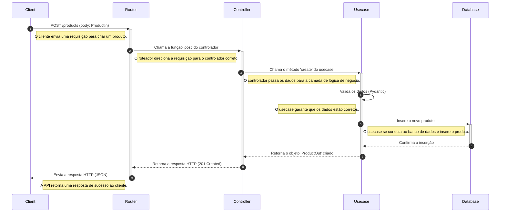

# TDD Project: Store API


---

### **Índice**
* [Descrição do Projeto](#-descrição-do-projeto)
* [Tecnologias Utilizadas](#-tecnologias-utilizadas)
* [Estrutura do Projeto](#-estrutura-do-projeto)
* [Status do Projeto](#-status-do-projeto)
* [Funcionalidades](#-funcionalidades-e-demonstração)
* [Como Usar a Aplicação](#-como-usar-a-aplicação)
* [Equipe do Projeto](#-equipe-do-projeto)
* [Conclusão](#-conclusão)
* [Prévia do Projeto](#-prévia-do-projeto)

---

### 📝 **Descrição do Projeto**

Este projeto é uma API de uma loja (`Store API`) desenvolvida com o objetivo de demonstrar a aplicação prática da metodologia de **Test-Driven Development (TDD)**, ou Desenvolvimento Orientado a Testes. Utilizando o poderoso framework **FastAPI** e a biblioteca de testes **Pytest**, o projeto foi construído em ciclos de "Teste-Código-Refatorar", garantindo uma base de código robusta e de alta qualidade desde o início.

O projeto utiliza o **MongoDB** como banco de dados e as dependências são gerenciadas pelo **Poetry**, oferecendo um ambiente de desenvolvimento limpo e consistente.

#### ⚙️ **Tecnologias Utilizadas**

* **Linguagem:** Python 3.12
* **Framework Web:** FastAPI
* **Gerenciador de Dependências:** Poetry
* **Banco de Dados:** MongoDB
* **Testes:** Pytest, Pytest-asyncio
* **Validação de Dados:** Pydantic
* **Conexão com DB:** Motor (driver assíncrono para MongoDB)
* **Ferramentas Adicionais:** Docker e Docker Compose

#### 📁 **Estrutura do Projeto**

A arquitetura do projeto é organizada de forma modular, com separação clara de responsabilidades:

```
.
├── store/                          # Código fonte da aplicação
│   ├── controllers/                # Camada de requisição/resposta (endpoints)
│   ├── core/                       # Configurações e exceções globais
│   ├── db/                         # Gerenciamento da conexão com o banco de dados
│   ├── models/                     # Modelos de dados do banco de dados
│   ├── schemas/                    # Schemas de validação de dados (Pydantic)
│   ├── usecases/                   # Lógica de negócio da aplicação
│   └── main.py                     # Ponto de entrada da aplicação
└── tests/                          # Testes unitários e de integração
├── controllers/
├── schemas/
└── usecases/
```
Diagramas de Sequência


Análise do Diagrama
Este diagrama detalha o fluxo completo da requisição:

* Cliente envia uma requisição POST para o endpoint /products com o corpo da requisição (ProductIn).
* Router (roteador do FastAPI) intercepta a requisição e a direciona para o Controller (o nosso product.py).
* Controller chama o método create da camada de lógica de negócio (Usecase).
* Usecase (nosso product_usecase) realiza a validação dos dados com o Pydantic antes de prosseguir.
* Usecase se conecta ao Database e executa a operação de inserção.
* Database responde, confirmando a inserção.
* A resposta retorna para o Usecase, que então retorna o objeto criado de volta para o Controller.
* Controller formata a resposta e a envia de volta para o Router.
* Router a envia para o Cliente com o código de status 201 Created e o objeto JSON do produto recém-criado.

#### 🚦 **Status do Projeto**

O projeto encontra-se em desenvolvimento. No momento, o foco está na implementação da camada de validação de schemas e configuração de ambiente. A próxima etapa é a criação e implementação da lógica de negócio (use cases) a partir dos testes.

---

### 🚀 **Funcionalidades e Demonstração**

#### **Principais Funcionalidades**

* **CRUD de Produtos:** A API permitirá a criação, leitura, atualização e exclusão de produtos.
* **Validação de Dados:** Utiliza Pydantic para garantir a integridade dos dados de entrada.
* **Testes Abrangentes:** Cada funcionalidade é coberta por testes unitários e de integração, garantindo o bom funcionamento e facilitando futuras manutenções.

#### **Como funciona**

O projeto adota a arquitetura em camadas, separando a lógica de negócio (Usecases) dos pontos de entrada da API (Controllers). O TDD guia o desenvolvimento, onde os testes são escritos antes do código de produção.

---

### 💻 **Como Usar a Aplicação**

1.  **Clone o Repositório:**
    ```bash
    git clone [https://github.com/amaro-netto/FastAPI_TDD.git](https://github.com/amaro-netto/FastAPI_TDD.git)
    cd seu-repositorio
    ```

2.  **Configuração do Ambiente Virtual com Poetry:**
    ```bash
    poetry install --with dev
    ```

3.  **Configuração do Banco de Dados:**
    * **Opção 1 (Recomendado):** Suba o contêiner do MongoDB com Docker Compose.
        ```bash
        docker-compose up -d
        ```
    * **Opção 2:** Ajuste a string de conexão no arquivo `.env` para apontar para o seu servidor MongoDB local.
        ```
        DATABASE_URL=mongodb://<host>:<porta>/store_api
        ```

4.  **Executar a Aplicação:**
    ```bash
    poetry run uvicorn store.main:app --reload
    ```
    A documentação interativa estará disponível em `http://127.0.0.1:8000/docs`.

5.  **Executar os Testes:**
    ```bash
    poetry run pytest
    ```

---

### 👥 **Equipe do Projeto**

<a href="https://github.com/amaro-netto" title="Amaro Netto"></a>

---

### ✅ **Conclusão**

Este projeto é uma jornada de aprendizado sobre TDD, demonstrando como essa metodologia pode levar a um código mais limpo, testável e confiável. O uso de ferramentas como FastAPI e Poetry complementa essa abordagem, tornando o desenvolvimento em Python mais eficiente e robusto.

---

### 📸 **Prévia do Projeto**


